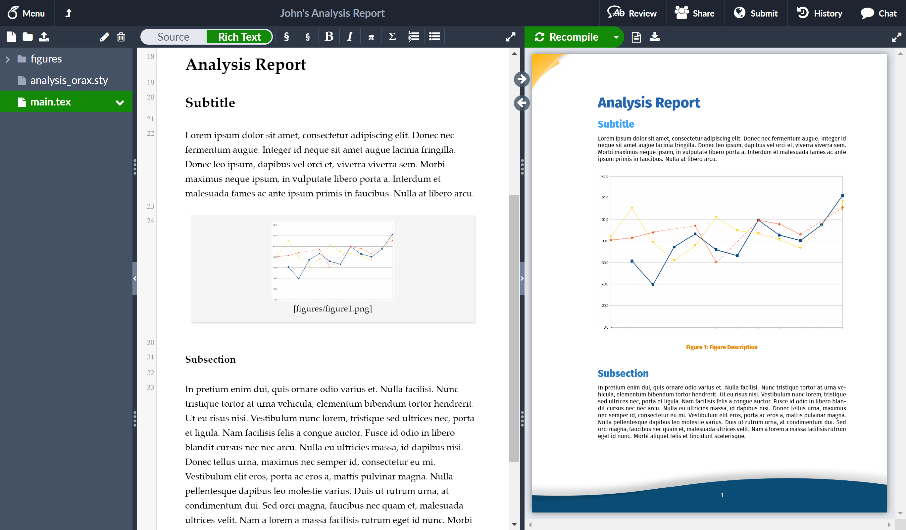

Title: Writing an Academic Journal Paper 
Date: 2021-02-02 
Category: Academic 
Tags: writing, phd, johns hopkins 
Slug: writing-journal-papers 
Authors: Adam Li 
Summary: A short walkthrough of my experience of writing an academic journal paper.

Writing Academic Journal Papers
===============================

Academic journal papers (preprint and peer-reviewed published) are the lifeblood of scientific researchers. These
samples of writing describe pieces of scientific work in a certain sub-field. For example, it might describe experiments
demonstrating the mechanisms of action to generate an action potential, or a cohort study of epilepsy patients that
underwent surgery or drug treatment. These are generally characterized by hypotheses, prior art motivation and a
rigorous methodology that leads to falsifiable results.

***Here, I assume that you have generated all your results already! I mainly discuss optimal workflows for writing papers
and dealing with revisions.***

Recommended Tools For Saving Time and Preventing Headaches
----------------------------------------------------------

These are recommended tools for writing a paper.

1. [Github](http://github.com/)
2. [Overleaf for Latex](http://overleaf.com/)
3. [Gigantum for web-based reproducing computational experiments](https://gigantum.com/)
4. [latexdiff for generating diff between two latex files](https://ctan.org/pkg/latexdiff?lang=en)
5. [inkscape (or Adobe Photoshop if you can afford it)](https://inkscape.org/)
6. [Mendeley or Zotero](https://www.mendeley.com/download-desktop-new/)
7. Preprint-servers: https://www.biorxiv.org/submit-a-manuscript and https://www.arxiv.org
8. [open-neuro for depositing open-access data](https://openneuro.org/)

Really, overleaf has an awesome interface that lets you look at latex and PDF and table of contents 
simultaneously.

The tools are recommended for the following reasons:

1. **Version-control**: whether it is code, manuscript, references, or data, version control is important!
2. **Ease-of-collaboration**: Many times you are going to be writing a paper simultaneously with collaborators, you would 
   to be able to work on things simultaneously! In addition, you could ideally comment in-place (yay overleaf).
3. **Modularity**: if you have ever used Microsoft word and tried to place a figure/caption near text, it is a nightmare. 
   If you have ever written 5 sections of a manuscript, and then had your PI want to take out 2-3 and then put back 1-2 
   at a later date, you'll wish you had some way of turning on/off sections. Latex is by design modular.
4. **Reproducibility**: Whether it is data analyses, or actually plotting the figures, science relies on these items being 
   fully reproducible by a 3rd party. Many of the steps that lead to these final presentations requires a lot of 
   package installations, environment handling and more. Gigantum is a nice mechanism for having a reproducible engine 
   hosted on the web. Github can maintain the original versions of your code used to produce said analyses/figures.
5. **Math typing**: typing math in microsoft word is a painful experience

### Some possible reasons for not using the above tools

Note that many of these tools require some bit of a learning curve. Notably, overleaf for latex, and Mendeley/Zotero 
for references. If you have collaborators that simply cannot use these tools, then that's an unfortunate 
circumstance... I have yet to discover an optimal workflow besides: render pdf / convert to word using Adobe, and 
then incorporate changes/notes afterwards.

Here's a good comparison on [word vs latex](https://openwetware.org/wiki/Word_vs._LaTeX#:~:text=Comparison%20of%20Word%20and%20Latex&text=The%20strength%20of%20Word%20is,layout%20in%20a%20separate%20step.).

Other notable tools
-------------------

1. Google docs
2. [auto-latex](https://workspace.google.com/marketplace/app/autolatex_equations/850293439076?pann=cwsdp&hl=en-US)
3. [paperpile](https://paperpile.com/)

If you intend on using these tools, possibly a similar workflow applies, but these are not directly discussed.

Starting a Paper (Latex)
------------------------

I recommend using Latex to write papers because they are modular and support version-control, whereas Word documents
inherently lack these features. In order to use latex, one can setup a local environment, but this becomes difficult 
to share. Therefore, we highly recommend Overleaf, which is an online latex editor that allows for 
tracking changes and simultaneous editing across many people. In addition, if you pay for the subscription, it 
allows integration with Github/Dropbox/Mendeley/Zotero.

Reproducible Figures and Main Experiments (Computational)
---------------------------------------------------------

Many journal papers are moving towards reproducability, since this has become a major 
issue in recent years. If you setup your code to do so, it helps facilitate this process, 
but also has the added benefit that ``people will more likely cite your study``, since they 
can confirm results for themselves! In order to facilitate **trivial** reproduction of your 
main figures in the paper, I suggest using a github repository with the following:

- ``README`` file describing installation process, main instructions to generate figures, instructions for downloading
  additional data and any misc. notes that users need to be aware of.
- ``data`` directory containing all the source data needed to reproduce figures and or run the experiment. These should
  be relatively small files, since they are housed in a Github repository.
- ``*.ipynb`` Jupyter notebooks that contain self-contained code to generate all main 
  figures and/or experiments described in the paper.

One should also include scripts (e.g. ``.py`` files) needed to support the generation 
of figures and/or experiments as well. 

Modularizing and Creating Figures
---------------------------------

Many journal papers before publishing your manuscript will want the raw high-resolution figures. 
This generally means using ``.pdf``, or ``.svg`` format, so that they do not lose resolution during
zooming in/out operations. In order to prepare for these later on, it is helpful to have each 
figure/subfigure in a file already! Inkscape (and/or Photoshop) can load SVG/PDF files and 
modify them. If you edit figures in these programs, then if you need to perform downstream 
edits (due to revisions), it becomes easy because you just pull up the file and perform edits.

Due to latex modularizing figures, you simply have to re-save the figures with the same filepath
as where your latex file is pulling from. An example with Overleaf and Dropbox integration would be:

1. You have Dropbox integrating your Overleaf document locally, and you need to change Figure 1, 
   stored at `figures/figure-1-blah.svg`.
2. Use inkscape to modify the figure and re-save at `figures/figure-1-blah.svg`.
3. Allow Dropbox/Overleaf to integrate (usually takes a few seconds).
4. Re-render the latex/PDF of the manuscript.

Modularizing References and Citations
-------------------------------------

When writing a manuscript, you'll need to keep track of all your references! Managing this manually 
is unwieldy and extremely prone to error. Use Mendeley (and/or Zotero)! These tools all have 
Overleaf integration, Desktop application and a Chrome browser extension. Thus one's workflow looks like:

1. Find reference online
2. Use browser extension to add reference and metadata to a library group
3. Export bibliography (``.bib``) file to directory for your Latex file to use
4. Re-render Latex PDF file

This has the advantage that one can easily change the citation formats, edit metadata and easily 
port the bibliography file to other manuscripts. 

Dealing with Revisions
----------------------

When dealing with revisions, one generally will need to generate a tracked-diff between the 
submission file and the revision file. This helps facilitate editor/reviewer feedback and 
if you do not do this, you will not be liked! This is obviously trivial with Microsoft Word, 
but it is an incredible headache to convert Latex/PDF files to Word. 

To handle a tracked-diff, ``save a copy of the Latex version upon initial manuscript submission.``
Then, when you have your final revised manuscript after revision, use ``latexdiff`` to generate 
a new Latex file, which will now render a nice PDF with tracked changes inside the PDF file itself!

    latexdiff-so old_version.tex new_version.tex > differences.tex

Here's a great reference: http://www.peteryu.ca/tutorials/publishing/latexdiff

(Optional) Converting Latex/PDF to Word
---------------------------------------

The only tool I know of currently that even relatively works is Adobe's export PDF to word 
functionality. Even there, it does not work great when you have mathematical equations,  
complex figures, and custom formatting! However, some journals for some reason still require
a word document for initial submission, so there you have it.

Submitting to Preprint
======================

Great! Now you have your manuscript version 1 ready to go. Well, unfortunately the submission process for many 
academic journals is more involved. Fortunately, you can still make your work publicly accessible via preprint 
servers! 

The preprint servers ([bioarxiv](https://submit.biorxiv.org/) and [arxiv](https://arxiv.org/user/)) are extremely 
easy to release a preprint. Bioarxiv is for generally more biological related sciences and arxiv is for the 
physical and mathematical sciences. There are also other preprint servers, like Medarxiv.

One must have:

- the rendered PDF files (main manuscript +/- supplemental pdf)
- supplemental data (optional)
- figures data (optional)
- emails and full names of all collaborators

and you are ready to go! Just make an account with the preprint server you are using and go through 
their submission process!

What to do next?
----------------

Nowadays, there is a deluge of preprints. To "advertise" your study, it is 
recommended to send this out to 1) collaborators and 2) post on Twitter!

Last but not least, remember that preprints are version controlled! You 
can always submit a new version when work has been improved and updated.